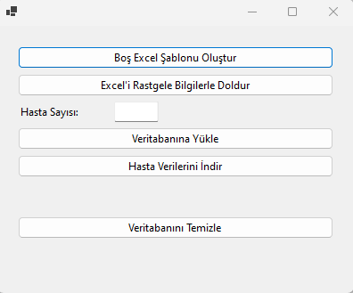

# Patient Record System

Patient Registration System is an application that enables the management of patients' records. With this application, you can add, delete patients' information in Excel template to the database and export this information from the database with Excel files.

## Features

- Create an empty Excel file and randomly fill in the desired number of patient data
- Add and delete patient records with Excel file
- Export patient information as an Excel file
- Integration with database

## Technologies Used

- **Frontend:** Windows Forms
- **Backend:** C#, .NET Framework
- **Database:** PostgreSQL
- **Excel Operations:** OfficeOpenXml

## Installation

Follow the steps below to run the project on your local machine:
- [.NET 8 SDK](https://dotnet.microsoft.com/download/dotnet/8.0) 
- [PostgreSQL](https://www.postgresql.org/download/)

## Addictions

The following NuGet packages must be installed to run the project:

- **EPPlus** (v7.2.1)
- **Microsoft.Extensions.Configuration** (v8.0.0)
- **Microsoft.Extensions.Configuration.Json** (v8.0.0)
- **Npgsql** (v8.0.3)

You can use the following commands to install these packages:
```sh
dotnet add package EPPlus --version 7.2.1
dotnet add package Microsoft.Extensions.Configuration --version 8.0.0
dotnet add package Microsoft.Extensions.Configuration.Json --version 8.0.0
dotnet add package Npgsql --version 8.0.3
```
### Steps

1. Clone this repository:
    ```bash
    git clone https://github.com/muhammetakkurtt/PatientRecordSystem.git
    cd PatientRecordSystem
    ```
2. Install the necessary dependencies:
    ```bash
    dotnet restore
    ```
3. `appsettings.json` update the database connection information in the file with your own information:
    ```json
    {
      "ConnectionStrings": {
        "DefaultConnection": "Host=localhost;Username=YOUR_USERNAME;Password=YOUR_PASSWORD;Database=hasta_kayit"
      }
    }
    ```
4. Run the necessary SQL commands to create the database:
    ```sql
    CREATE TABLE hasta_kayit (
        hasta_id SERIAL PRIMARY KEY,
        kimlik_no VARCHAR(20),
        adi VARCHAR(50),
        soyadi VARCHAR(50),
        dogum_tarihi DATE,
        telefon_numarasi VARCHAR(15),
        cinsiyet VARCHAR(10),
        adres VARCHAR(100),
        ilce VARCHAR(50),
        il VARCHAR(50),
        ulke VARCHAR(50),
        anne_adi VARCHAR(50),
        baba_adi VARCHAR(50),
        eposta VARCHAR(50),
        kan_grubu VARCHAR(5),
        meslek VARCHAR(50),
        pasaport_numarasi VARCHAR(20)
    );
    ```
5. Start the application:
    ```bash
    dotnet run
    ```

## Usage

- **Create Empty Excel Template:** Creates an empty Excel template.
- **Fill Excel with Random Information:** Fills the Excel file with random information.
- **Upload to Database:** Uploads the data from the Excel file to the database.
- **Download Patient Data:** Imports patient records from the database to the Excel file.
- **Clear Database:** Deletes all records in the database.

### Application Interface
The application interface is as follows:


